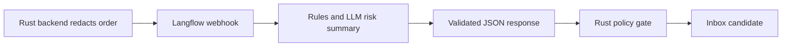

# Langflow Risk Webhook Prototype

This prototype is advisory only. It must not place orders, refund, intercept shipments, ban users, update rules, mutate blacklists, or send external alerts by itself.

## Flow



## Redacted Request

```json
{
  "request_id": "risk_req_001",
  "tenant_id": "tenant_a",
  "shop_id": "shop_1",
  "order_id": "ord_123",
  "features": {
    "amount_cents": 259900,
    "buyer_age_days": 2,
    "phone_hash_present": true,
    "address_hash_present": true,
    "rule_hits": ["new_buyer_high_amount"],
    "prior_order_count": 0
  },
  "policy": {
    "advisory_only": true,
    "irreversible_actions_require_manual_review": true
  }
}
```

Do not send raw phone numbers, addresses, ID numbers, full emails, tokens, webhook URLs, or raw order payloads.

## Response Contract

```json
{
  "risk_score": 72.5,
  "risk_level": "medium",
  "reason": "New buyer with high order amount and sparse history.",
  "suggested_action": "manual_review",
  "policy_flags": ["new_buyer_high_amount"],
  "requires_manual_review": true
}
```

Invalid, oversized, timed out, or unavailable responses must be converted to `data_insufficient`.

## Curl Smoke

```bash
curl -X POST "https://risk-sidecar.example.com/webhook/order-risk" \
  -H "Content-Type: application/json" \
  -H "Authorization: Bearer $RISK_SIDECAR_TOKEN" \
  --data @redacted-order.json
```

## Rust Caller Skeleton

```rust
use serde::{Deserialize, Serialize};
use std::time::Duration;

#[derive(Debug, Serialize)]
struct SidecarRequest {
    request_id: String,
    tenant_id: String,
    shop_id: String,
    order_id: String,
    features: serde_json::Value,
}

#[derive(Debug, Deserialize)]
struct SidecarResponse {
    risk_score: f64,
    risk_level: String,
    reason: String,
    suggested_action: String,
    policy_flags: Vec<String>,
    requires_manual_review: bool,
}

async fn call_sidecar(
    client: &reqwest::Client,
    url: &str,
    token: &str,
    body: &SidecarRequest,
) -> anyhow::Result<SidecarResponse> {
    let response = client
        .post(url)
        .bearer_auth(token)
        .timeout(Duration::from_secs(3))
        .json(body)
        .send()
        .await?
        .error_for_status()?;

    let parsed = response.json::<SidecarResponse>().await?;
    validate_sidecar_response(&parsed)?;
    Ok(parsed)
}

fn validate_sidecar_response(response: &SidecarResponse) -> anyhow::Result<()> {
    if !(0.0..=100.0).contains(&response.risk_score) {
        anyhow::bail!("risk score out of range");
    }
    if response.reason.trim().is_empty() {
        anyhow::bail!("missing reason");
    }
    Ok(())
}
```

Before wiring this into runtime, add tests for timeout, invalid schema, low-risk no-action, manual-review escalation, and redaction.
